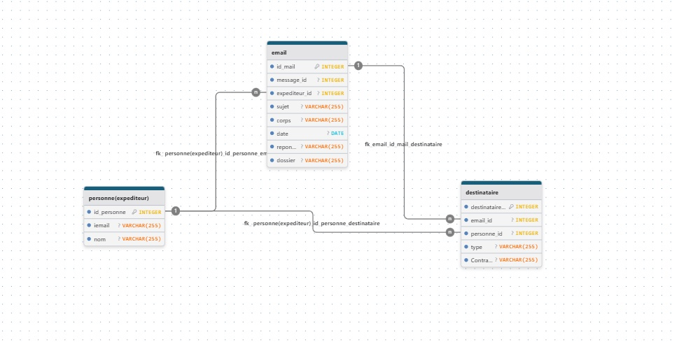

# Projet Enron Discovery
## 👥 Auteur principal
**Yves GNONHOUE** – Développement, modélisation & tests  
*Projet réalisé en collaboration avec Carmel AWANDE dans le cadre du Master 1 Data Science*

# 📧 Enron Discovery – Plateforme d'investigation e-Discovery

[](https://python.org)
[](https://djangoproject.com)
[](https://postgresql.org)
[](https://docker.com)

> **490 847 emails analysés** – Un outil d'aide à l'investigation numérique basé sur le Enron Corpus

---

## 📋 Sommaire
- [Contexte](#-contexte-du-projet)
- [Stack technique](#-stack-technique)
- [Fonctionnalités](#-fonctionnalités-implémentées)
- [Modélisation des données](#-modélisation-des-données-mcd)
- [Extraction & parsing](#-extraction-et-parsing)
- [Interface web](#-interface-web)
- [Installation](#-installation-et-exécution)
- [Auteur](#-auteur-principal)

---

## 📋 Contexte du projet

Ce projet vise à concevoir un **outil d'aide à l'investigation numérique** à partir du Enron Corpus, un jeu de données contenant plus de **500 000 emails** issus d'une entreprise réelle après un scandale financier majeur.

**Objectifs :**
- Naviguer dans les échanges
- Identifier des acteurs clés
- Rechercher des informations critiques
- Reconstruire des fils de discussion

---

## 🧰 Stack technique

| Composant | Technologie | Rôle |
|-----------|-------------|------|
| Backend | Django 5.2 | Framework web principal |
| Base de données | SQLite / PostgreSQL | Stockage structuré |
| Parsing | Python (email, pandas) | Extraction des emails bruts |
| Frontend | Bootstrap 5 + Chart.js | Interface responsive |
| Conteneurisation | Docker | Isolation PostgreSQL |
| Versionnage | Git | Gestion du code source |

---

## ✅ Fonctionnalités implémentées

| Statut | Fonctionnalité |
|--------|----------------|
| ✅ | Dashboard avec statistiques globales (490 847 emails, 77 780 personnes) |
| ✅ | Graphique volume d'emails par mois (1998-2002) |
| ✅ | Top 10 des expéditeurs les plus actifs |
| ✅ | Recherche avancée (mots-clés, dates, expéditeur) |
| ✅ | Autocomplétion sujets/expéditeurs en temps réel |
| ✅ | Explorateur de fils de discussion chronologique |
| ✅ | Nettoyage des données (encodages, signatures) |
| ✅ | Index GIN pour recherche plein texte PostgreSQL |

---

## 🗄️ Modélisation des données (MCD)

### Schéma relationnel



### Entités principales

**Personne** – Stockage unique des acteurs
- `id` : identifiant unique
- `email` : adresse normalisée (unique)
- `nom` : nom de la personne

**Email** – Représente un message
- `id`, `message_id`, `expediteur_id`, `sujet`, `corps`, `date`
- `reponse_a_id` : auto-référence pour les fils de discussion
- `dossier` : arborescence (boîte de réception, envoyés...)

**Destinataire** – Relation many-to-many avec typage
- `email_id`, `personne_id`, `type` (to / cc / bcc)

### Indexation PostgreSQL
```sql
CREATE INDEX idx_email_date ON email(date);
CREATE INDEX idx_email_expediteur ON email(expediteur_id);
CREATE INDEX idx_email_corps_gin ON email USING GIN(to_tsvector('french', corps));
```

## ⚙️ Extraction et parsing
Script principal : scripts/import_enron.py

# Pipeline :
1. Parcours de l'arborescence maildir/

2. Extraction des métadonnées avec email library

3. Nettoyage et normalisation des adresses

4. Extraction du corps du message

5. Suppression des signatures

6. Insertion en base avec gestion des clés étrangères

## 🌐 Interface web

## Dashboard global
- Métriques : total emails, personnes uniques, période couverte
- Graphique linéaire interactif Chart.js
- Top 10 expéditeurs

## Moteur de recherche
- Autocomplétion sujets/expéditeurs
- Recherche plein texte
- Filtrage par dates et expéditeur

## Explorateur de threads
- Affichage chronologique email + réponses
- Message original encadré en bleu
- Liens parents/enfants

## 🐳 Déploiement avec Docker
version: '3.8'
services:
  postgres:
    image: postgres:15
    container_name: enron_postgres
    environment:
      POSTGRES_DB: enron_db
      POSTGRES_USER: enron_user
      POSTGRES_PASSWORD: enron_password
    ports:
      - "5432:5432"

## 🚀 Installation et exécution

# 1. Cloner
git clone https://github.com/yvesgnonhoue/enron-discovery.git
cd enron-discovery
# 2. Environnement virtuel
python -m venv venv
source venv/bin/activate  # ou venv\Scripts\activate
# 3. Dépendances
pip install -r requirements.txt
# 4. Migrations
python manage.py migrate
# 5. Lancement
python manage.py runserver
# 6. Import des données
cd scripts && python import_enron.py

## 📊 Statistiques sur le dataset

| Métrique | Valeur |
|----------|--------|
| Total emails | 490 847 |
| Personnes uniques | 77 780 |
| Période | 1998–2002 |
| Taille (compressé) | 1.7 Go |

---

📧 [yvanognonhoue@gmail.com](mailto:yvanognonhoue@gmail.com)
🔗 [GitHub](https://github.com/yvesgnonhoue)

---

## 📝 Notes importantes
-Les données brutes (dossier data/) ne sont pas incluses dans le dépôt Git
-L application utilise SQLite par défaut pour le développement
-Le passage à PostgreSQL est documenté et prêt via Docker
-Les index GIN sont actifs uniquement avec PostgreSQL

---

🔗 Lien du dépôt
https://github.com/yvesgnonhoue/enron-discovery


